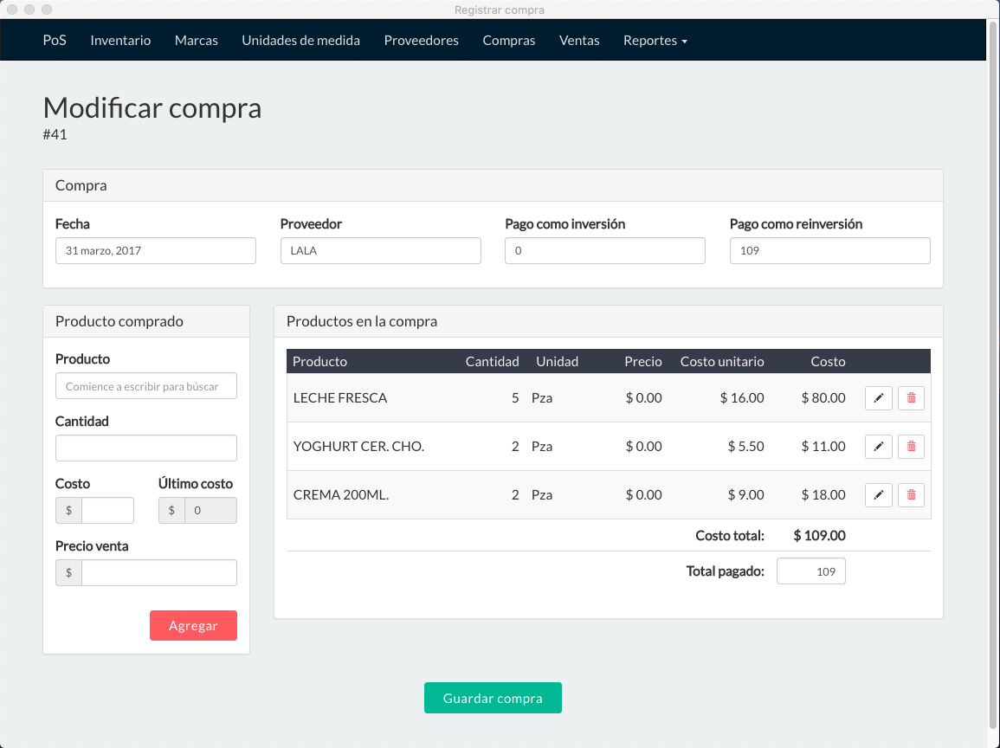
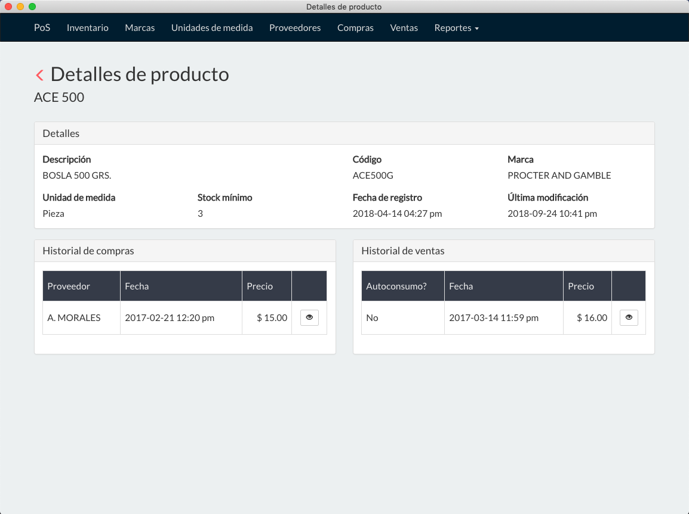
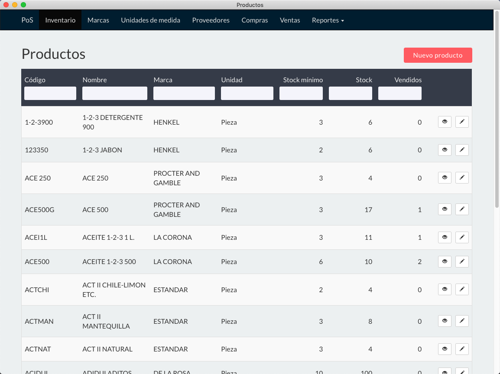

PoS For the people
==================
A Point of Sales for micro & small business in latam

There are a lot of small business that does not require and overcomplicated,
ultra flexible, and redundant Point of sales. This kind of businesses usually
are managed by non technical people.

The purpose of this project is to bring an easy to use Point of sales to manage
a small inventory, a list of providers, purchases, sales and a few reports. Also
the application works offline and the end user should not configure anything
to be able to use it. Simply download, double click and whala.
All through a very intuitive UI.

## Technology stack
The project is built with:
* Electron JS
* React JS
* SQLite 3
* Sequelizer JS
* Bootstrap

## Application in action






## How to work on it
There are currently a lot of things to work and polish, you can clone this repo
and run it:

```bash
npm install
npm run start
```

You can now start to hacking on this 'PoS for the real people'
